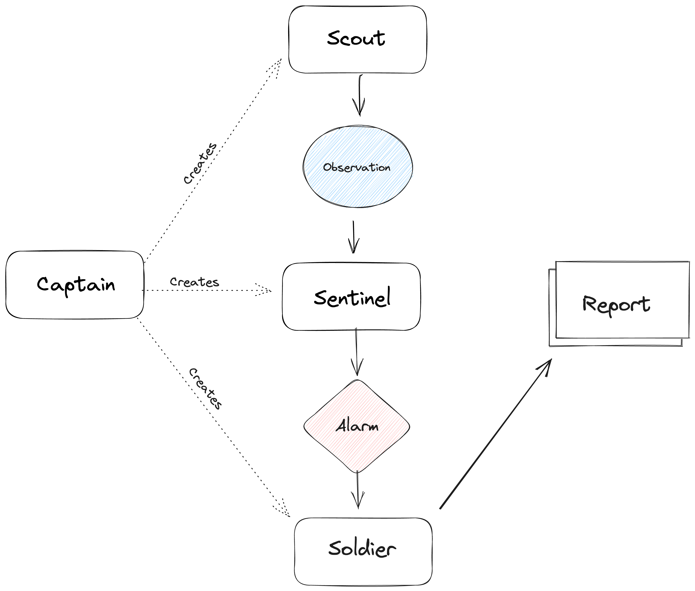

# WhenX: Event-Driven Autonomous Agents


The Semantic Web has long intrigued me. The idea of transforming the web into a comprehensible database accessible to artificial intelligence became a foundation for my continued exploration. The notion of creating a smart alert system, a digital sentinel standing guard over the information chaos of the internet, was an application that continuously sparked my curiosity. Imagine a robot that ceaselessly trawls the vast ocean of the web, alerting you to the occurrence of a specific event, say, the release of a new book. This is a dream I have been chasing for years.

The emergence of autonomous agents like AutoGPT and BabyAGI piqued my interest. These systems represented a promising new direction for AI technology. I decided to experiment with these tools, with the aspiration of realizing my dream of a smart alert system. My excitement, however, was quickly tempered. These systems, while advanced, operate with a focus on a goal and its subsequent division into steps. This is a far cry from the continuous, vigilant monitoring system I envisioned. Much to my disappointment, I found their architecture ill-suited for such a task. You can make it work sometimes but not reliably. 

The shortcomings of existing models lit a spark to build something new. I decided to create my own system, a system of event-driven autonomous agents. I call it WhenX.

The system's goal is to create alerts in the form of  "When X happens, then do Y". In this initial version, we are only supporting email alerts in the form of "When X happens, send me an email report". 

### **This is an early experimental project with many bugs! I am still working on it.**

# Architecture



**The system is composed by four agents: The Captain, the Scout, the Sentinel, and the Soldier.**

**The Captain** is the conductor of this orchestra. Given a mission, it is responsible for assembling a team of agents - a Scout, a Sentinel, and a Soldier. 

**The Scout** serves as the explorer, the one who embarks on the quest for relevant information, creating 'Observations' along its journey. These Observations are the essential raw materials that fuel the WhenX system.

**The Sentinel**, the gatekeeper, scrutinizes the last N Observations made by the Scout. It is a discerning entity, designed to identify changes, no matter how subtle, in the Observation data. When it detects something noteworthy, it triggers an 'Alarm', signaling the Soldier to action.

**The Soldier**, the executor, springs into action upon receiving Alarms from the Sentinel. It executes instructions based on the alarms, crafting a 'Report' that encapsulates the detected change or event.


# Installation

```Bash
$ poetry install
```

```Bash
$ poetry run alembic upgrade head
```

Copy the .env.example file to .env and fill in the values. We are using the [Resend](https://resend.com/) service 
to send emails. You can create a free account and use it for testing.


# Usage

The goal of the system is to create alerts in the form of "When X happens" then "Send me a report". In this initial version, we are only supporting email alerts.

## Create a new alert
First we need to create a mission. A mission is a description of the alert. For example, "When Haruki Murakami releases a new book".
```Bash
$ python -m whenx create --mission "when Haruki Murakami releases a new book."
```
## Run the system
The system will start running and will create a new Observation every  day. The Observation is a snapshot of the current state of your query. The system will compare the last 2 observations and if it detects a change, it will send an email with the report.
```Bash
$ python -m whenx monitor
```

## List all alerts
You can list all alerts and their status.
```Bash
$ python -m whenx list
```

## Delete an alert
You can delete an alert by its id.
```Bash
$ python -m whenx delete --id a5dc910a-4457-4911-8ba3-c7713588e7ff
```
